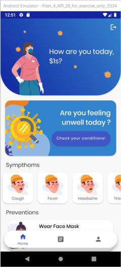
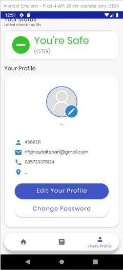
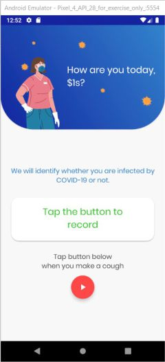
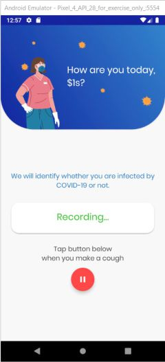

# Android Covid Detector <h1>
A Covid Detector App illustrating Android development practices with Android Jetpack.

This application to identify if user has infected with Covid-19. With this application we can detect if a person gets infected by covid-19 using cough sound. Hence, with this application we can anticipate the infection of covid-19 before it gets worse.  
Android Covid Detector is currently under development. Some changes (such as database schema modifications).
  
## App Screenshots <h2>

  
## Main Feature Screenshots <h2>

## Introduction <h2>
We developed our app using Android Jetpack guideline. Android Jetpack is a set of components, tools and guidance to make great Android apps. They bring together the existing Support Library and Architecture Components and arrange them into four categories:

Android Covid Detector demonstrates utilizing these components to create a simple detect covid using sound of cough.
  
##  Latest Updated Branch <h2>
* master (Added main feature: Covid Detection with tensorflow lite)
* development-1.0 (Added main feature: Covid Detection with tensorflow lite)
  
##  Getting Started <h2>
This project uses the Gradle build system. To build this project, use the
`gradlew build` command or use "Import Project" in Android Studio.

There are two Gradle tasks for testing the project:
* `connectedAndroidTest` - for running Espresso on a connected device
* `test` - for running unit tests

For more resources on learning Android development, visit the
[Developer Guides](https://developer.android.com/guide/) at
[developer.android.com](https://developer.android.com).

## Libraries Used <h2>

- Foundation 
  - AppCompat
  - Android KTX 
  - Test
- Architecture
  - Data Binding
  - Lifecycles
  - LiveData
  - ViewModel
  - Navigation 
  - Room (Local Database)
  - Firebase real-time database (Remote Database)
  - Firebase Storage (Remote Storage)
- UI
  - Fragment
  - Layout
- Third party and miscellaneous libraries
  - Glide for image loading
  - CircleImage
  - dmax Spot Dialog
  - TensorFlow Lite (Machine Learning)
 
## Continous Integration Tools <h2>
Circle CI
  
## Upcoming features <h2>
Updates will include news feature using API to get latest information about COVID-19 for users.
  
## Machine Learning Documentation <h2>
- Download Dataset
- Preprocess Dataset
- Make model and training dataset 
- Create Prediction
- Result Prediction
- Convert keras model to tflite model
  
## Cloud Computing Documentation <h2>
- Create VM Instance for running Jupyter Notebooks, Tensorflow, Keras.
- Create firebase to store user data
- Create custom model tflite on firebase

  
